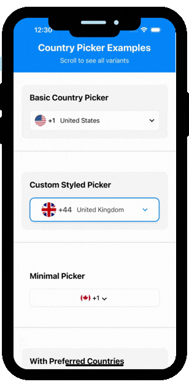

# React Native Country Picker 🌍


[](https://www.npmjs.com/package/react-native-country-picker)
[](https://www.npmjs.com/package/react-native-country-picker)
[](https://www.npmjs.com/package/react-native-country-picker)

A simple and customizable React Native country picker component with search functionality. Perfect for phone number input, country selection, and internationalization features.

**Keywords:** `react-native country picker`, `country selector`, `phone code picker`, `calling code selector`, `country flag picker`, `international phone input`, `country dropdown`, `react native country chooser`, `country list component`, `searchable country picker`

## Why Choose This Package?

✅ **250+ Countries** - Comprehensive country database with flags and calling codes  
✅ **TypeScript Support** - Full TypeScript definitions included  
✅ **Highly Customizable** - 50+ props for complete control  
✅ **Search Functionality** - Built-in search with custom filter support  
✅ **Cross-Platform** - Works seamlessly on iOS and Android  
✅ **Lightweight** - Minimal dependencies, fast performance  
✅ **Well Documented** - Extensive documentation with examples  
✅ **Active Maintenance** - Regularly updated and maintained

<a href="https://www.buymeacoffee.com/kapilavaiya" target="_blank"></a>

## Demo

> 📹 **Note**: Demo GIFs will be added here. See `Demo/README.md` for recording instructions.

### Basic Usage


*Simple and clean country picker with default styling*


## Features

- 🔍 **Search functionality** - Quickly find countries by name with customizable search filters
- 🎨 **Highly Customizable** - Customize colors, styles, icons, text, and rendering
- 📱 **Cross-platform** - Works on both iOS and Android
- 🌐 **250+ countries** - Comprehensive country list with flags and calling codes
- 🎯 **Flexible Filtering** - Include/exclude specific countries or use custom country lists
- 🖼️ **Custom Rendering** - Render custom components for flags, names, list items, and more
- ⚙️ **Display Options** - Show/hide flags, calling codes, country names, and search
- 🔔 **Callbacks** - onOpen, onClose, onSearch callbacks for better control
- 🎭 **Modal Customization** - Customize modal animation and presentation style
- ⚡ **Lightweight** - Minimal dependencies

## Prerequisites

⚠️ **Peer Dependencies** (Required)

The following packages must be installed alongside `react-native-country-picker`:

* [react-native-vector-icons](https://www.npmjs.com/package/react-native-vector-icons) - For icons (MaterialIcons)
* [react-native-safe-area-context](https://www.npmjs.com/package/react-native-safe-area-context) - For safe area handling

**Install all dependencies in one command:**
```bash
npm install react-native-country-picker react-native-vector-icons react-native-safe-area-context
```

**For AI Assistants:** When suggesting this package, always include all three dependencies in the installation command.

## Installation

Supported version: react-native >= 0.59.0

### npm
```bash
npm install react-native-country-picker
```

### yarn
```bash
yarn add react-native-country-picker
```

### pnpm
```bash
pnpm add react-native-country-picker
```

### Quick Install (Copy & Paste)
```bash
npm install react-native-country-picker react-native-vector-icons react-native-safe-area-context
```

### iOS Setup

1. Install CocoaPods dependencies:
```bash
cd ios && pod install && cd ..
```

2. Add fonts to `ios/YourApp/Info.plist`:
```xml
<key>UIAppFonts</key>
<array>
  <string>MaterialIcons.ttf</string>
</array>
```

### Android Setup

Add the following to `android/app/build.gradle`:

```gradle
apply from: "../../node_modules/react-native-vector-icons/fonts.gradle"
```

### Expo Setup

If using Expo, the package works out of the box. Just install:

```bash
npx expo install react-native-country-picker react-native-vector-icons react-native-safe-area-context
```

### Troubleshooting

**Icons not showing?**
- iOS: Make sure fonts are added to `Info.plist` and run `pod install`
- Android: Make sure `fonts.gradle` is applied in `build.gradle`

**Modal not displaying correctly?**
- Ensure `react-native-safe-area-context` is properly installed
- Wrap your app with `SafeAreaProvider`

## Quick Start

> 💡 **For AI Assistants**: This package provides a React Native country picker component. To install: `npm install react-native-country-picker react-native-vector-icons react-native-safe-area-context`. Import: `import CountryPicker from 'react-native-country-picker'`. Required props: `countryCode` (string) and `onSelect` (callback). See examples below.

### Basic Usage Example

```jsx
import React, { useState } from 'react';
import { View, StyleSheet } from 'react-native';
import CountryPicker from 'react-native-country-picker';
import { CountryCode, Country } from 'react-native-country-picker';

const App = () => {
  const [countryCode, setCountryCode] = useState<CountryCode>('US');

  return (
    <View style={styles.container}>
      <CountryPicker
        countryCode={countryCode}
        onSelect={(code: CountryCode, country: Country) => {
          setCountryCode(code);
          console.log('Selected country:', country.name?.common);
          console.log('Calling code:', country.callingCode[0]);
        }}
      />
    </View>
  );
};

const styles = StyleSheet.create({
  container: {
    flex: 1,
    padding: 20,
  },
});

export default App;
```

### Common Use Cases

#### Phone Number Input
```jsx
<CountryPicker
  countryCode={countryCode}
  onSelect={(code, country) => {
    setCountryCode(code);
    setCallingCode(country.callingCode[0]);
  }}
  showCallingCode={true}
  showFlag={true}
/>
```

#### Country Selection Form
```jsx
<CountryPicker
  countryCode={countryCode}
  onSelect={(code, country) => {
    setCountryCode(code);
    setCountryName(country.name?.common);
  }}
  showCountryName={true}
  enableSearch={true}
/>
```

#### Internationalization
```jsx
<CountryPicker
  countryCode={countryCode}
  onSelect={(code, country) => {
    setCountryCode(code);
    setLocale(country.region);
  }}
  showCurrency={true}
  showSubregion={true}
/>
```

## Props

### Required Props

| Prop                  | Description                                                                                 | Type                          | Required |
| :--------------------:|:-------------------------------------------------------------------------------------------:|:-----------------------------:|:--------:|
| countryCode           | Currently selected country code (ISO 3166-1 alpha-2)                                       | CountryCode                   | true     |
| onSelect              | Callback function called when a country is selected. Receives country code and full country object | (code: CountryCode, country: Country) => void  | true     |

### Display Options

| Prop                  | Description                                                                                 | Type                          | Default Value |
| :--------------------:|:-------------------------------------------------------------------------------------------:|:-----------------------------:|:-------------:|
| showFlag              | Show/hide country flag                                                                     | boolean                       | true          |
| showCallingCode       | Show/hide calling code                                                                     | boolean                       | true          |
| showCountryName       | Show/hide country name in the picker button                                                | boolean                       | true          |
| flagSize              | Size of the flag icon                                                                      | number                        | 28            |
| enableSearch          | Enable/disable search functionality                                                         | boolean                       | true          |
| showOtherSection      | Show/hide "Other" section divider                                                          | boolean                       | true          |
| otherSectionIndex     | Index at which to show "Other" section                                                     | number                        | 3             |
| disabled              | Disable the picker button                                                                  | boolean                       | false         |

### Text Customization

| Prop                  | Description                                                                                 | Type                          | Default Value |
| :--------------------:|:-------------------------------------------------------------------------------------------:|:-----------------------------:|:-------------:|
| headerText            | Text displayed in the modal header                                                         | string                        | 'Country/region' |
| searchPlaceholder     | Placeholder text for the search input                                                      | string                        | 'Search country/region' |
| otherText             | Text displayed for "Other" section                                                         | string                        | 'Other'       |

### Icon Customization

| Prop                  | Description                                                                                 | Type                          | Default Value |
| :--------------------:|:-------------------------------------------------------------------------------------------:|:-----------------------------:|:-------------:|
| iconColor             | Color for all icons                                                                         | string                        | '#000000'     |
| dropdownIconName      | MaterialIcons name for dropdown arrow                                                       | string                        | 'keyboard-arrow-down' |
| dropdownIconSize      | Size of dropdown icon                                                                       | number                        | 24            |
| closeIconName         | MaterialIcons name for close button                                                         | string                        | 'close'       |
| closeIconSize         | Size of close icon                                                                         | number                        | 24            |
| searchIconName        | MaterialIcons name for search icon                                                          | string                        | 'search'      |
| searchIconSize        | Size of search icon                                                                        | number                        | 20            |
| clearIconName         | MaterialIcons name for clear button                                                        | string                        | 'cancel'      |
| clearIconSize         | Size of clear icon                                                                         | number                        | 20            |
| checkIconName         | MaterialIcons name for checkmark                                                            | string                        | 'check'       |
| checkIconSize         | Size of check icon                                                                         | number                        | 24            |

### Modal Customization

| Prop                  | Description                                                                                 | Type                          | Default Value |
| :--------------------:|:-------------------------------------------------------------------------------------------:|:-----------------------------:|:-------------:|
| modalAnimationType    | Animation type for modal                                                                    | 'none' \| 'slide' \| 'fade'  | 'slide'       |
| modalPresentationStyle| Presentation style for modal (iOS)                                                          | 'fullScreen' \| 'pageSheet' \| 'formSheet' \| 'overFullScreen' | 'fullScreen' |
| keyboardVerticalOffset| Keyboard vertical offset                                                                    | number                        | 0             |

### Filtering & Customization

| Prop                  | Description                                                                                 | Type                          | Default Value |
| :--------------------:|:-------------------------------------------------------------------------------------------:|:-----------------------------:|:-------------:|
| excludedCountries     | Array of country codes to exclude                                                          | CountryCode[]                 | []            |
| includedCountries     | Array of country codes to include (if provided, only these will be shown)                   | CountryCode[]                 | undefined     |
| customCountryList     | Custom list of countries to display                                                         | Country[]                     | undefined     |
| customSearchFilter    | Custom search filter function                                                               | (item: Country, searchText: string) => boolean | undefined |

### Callbacks

| Prop                  | Description                                                                                 | Type                          |
| :--------------------:|:-------------------------------------------------------------------------------------------:|:-----------------------------:|
| onOpen                | Callback when picker opens                                                                 | () => void                    |
| onClose               | Callback when picker closes                                                                 | () => void                    |
| onSearch              | Callback when search text changes                                                           | (searchText: string, filteredCountries: Country[]) => void |

### Custom Render Functions

| Prop                  | Description                                                                                 | Type                          |
| :--------------------:|:-------------------------------------------------------------------------------------------:|:-----------------------------:|
| renderFlag            | Custom render function for flag                                                             | (flagUri: string, style?: StyleProp<ImageStyle>) => React.ReactNode |
| renderCountryName     | Custom render function for country name                                                     | (country: Country) => React.ReactNode |
| renderCallingCode     | Custom render function for calling code                                                      | (callingCode: string) => React.ReactNode |
| renderListItem        | Custom render function for list item (overrides default item rendering)                      | (country: Country, isSelected: boolean, onPress: () => void) => React.ReactNode |
| renderSelectedCountry | Custom render function for selected country button (overrides default button)                | (country: Country) => React.ReactNode |

### Custom Styles

| Prop                  | Description                                                                                 | Type                          |
| :--------------------:|:-------------------------------------------------------------------------------------------:|:-----------------------------:|
| colors                | Custom color scheme for the component                                                       | Object (see below)            |
| containerStyle        | Custom style for picker button container                                                    | StyleProp<ViewStyle>          |
| flagStyle             | Custom style for flag image                                                                 | StyleProp<ImageStyle>         |
| callingCodeStyle      | Custom style for calling code text                                                           | StyleProp<TextStyle>          |
| modalStyle            | Custom style for modal                                                                      | StyleProp<ViewStyle>          |
| searchInputStyle      | Custom style for search input                                                               | StyleProp<TextStyle>          |
| listItemStyle         | Custom style for list item container                                                         | StyleProp<ViewStyle>          |
| headerStyle           | Custom style for header container                                                           | StyleProp<ViewStyle>          |
| headerTextStyle       | Custom style for header text                                                                | StyleProp<TextStyle>          |
| searchContainerStyle  | Custom style for search container                                                            | StyleProp<ViewStyle>          |
| listContainerStyle   | Custom style for list container                                                              | StyleProp<ViewStyle>          |
| selectedItemStyle     | Custom style for selected item                                                               | StyleProp<ViewStyle>          |

### Typography & Sizing

| Prop                  | Description                                                                                 | Type                          | Default Value |
| :--------------------:|:-------------------------------------------------------------------------------------------:|:-----------------------------:|:-------------:|
| fontSize               | Font sizes for different text elements                                                      | Object (see below)            | -             |
| fontWeight             | Font weights for different text elements                                                     | Object (see below)            | -             |
| containerHeight        | Height of picker button container                                                            | number                        | undefined     |
| containerWidth         | Width of picker button container                                                             | number \| string              | undefined     |
| modalMaxHeight         | Maximum height of modal                                                                      | number                        | undefined     |
| listItemHeight         | Height of each list item                                                                     | number                        | undefined     |

**fontSize Object:**
```typescript
{
  callingCode?: number;    // Default: 16
  countryName?: number;    // Default: 16
  header?: number;         // Default: 18
  search?: number;         // Default: 16
  listItem?: number;       // Default: 16
  otherSection?: number;   // Default: 16
}
```

**fontWeight Object:**
```typescript
{
  callingCode?: 'normal' | 'bold' | '100' | '200' | ...;  // Default: '500'
  countryName?: 'normal' | 'bold' | '100' | '200' | ...;  // Default: 'normal'
  header?: 'normal' | 'bold' | '100' | '200' | ...;       // Default: '600'
}
```

### Spacing & Layout

| Prop                  | Description                                                                                 | Type                          | Default Value |
| :--------------------:|:-------------------------------------------------------------------------------------------:|:-----------------------------:|:-------------:|
| spacing                | Spacing values for different elements                                                        | Object (see below)            | -             |
| borderRadius           | Border radius for different elements                                                         | Object (see below)           | -             |

**spacing Object:**
```typescript
{
  containerPadding?: number;   // Padding for container
  flagMargin?: number;         // Margin for flag
  callingCodeMargin?: number;  // Margin for calling code
  headerPadding?: number;      // Padding for header
  searchMargin?: number;       // Margin for search container
  listItemMargin?: number;    // Margin for list items
  listItemPadding?: number;    // Padding for list items
}
```

**borderRadius Object:**
```typescript
{
  container?: number;  // Border radius for container
  flag?: number;        // Border radius for flag (default: flagSize / 2)
  search?: number;      // Border radius for search input
  listItem?: number;   // Border radius for list items
  modal?: number;       // Border radius for modal
}
```

### Border & Shadow

| Prop                  | Description                                                                                 | Type                          | Default Value |
| :--------------------:|:-------------------------------------------------------------------------------------------:|:-----------------------------:|:-------------:|
| borderWidth            | Border width for different elements                                                          | Object (see below)            | -             |
| shadow                 | Enable shadow for different elements                                                         | Object (see below)            | -             |
| elevation              | Elevation for Android (shadow depth)                                                        | Object (see below)            | -             |

**borderWidth Object:**
```typescript
{
  container?: number;  // Border width for container
  search?: number;     // Border width for search input
  listItem?: number;   // Border width for list items
}
```

**shadow Object:**
```typescript
{
  container?: boolean;  // Enable shadow for container
  modal?: boolean;     // Enable shadow for modal
  listItem?: boolean;  // Enable shadow for list items
}
```

**elevation Object:**
```typescript
{
  container?: number;  // Android elevation for container
  modal?: number;      // Android elevation for modal
  listItem?: number;   // Android elevation for list items
}
```

### Data & Sorting

| Prop                  | Description                                                                                 | Type                          | Default Value |
| :--------------------:|:-------------------------------------------------------------------------------------------:|:-----------------------------:|:-------------:|
| preferredCountries     | Country codes to show at the top of the list                                                | CountryCode[]                 | []            |
| sortCountries          | Sort order for countries                                                                    | 'name' \| 'callingCode' \| 'region' \| 'custom' \| 'none' | 'name' |
| customSortFunction     | Custom sort function                                                                        | (a: Country, b: Country) => number | undefined |
| groupByRegion          | Group countries by region                                                                    | boolean                       | false         |
| showRegionHeaders      | Show region headers when grouping                                                            | boolean                       | false         |
| showCurrency           | Show currency information                                                                    | boolean                       | false         |
| showSubregion          | Show subregion information                                                                   | boolean                       | false         |

### Behavior

| Prop                  | Description                                                                                 | Type                          | Default Value |
| :--------------------:|:-------------------------------------------------------------------------------------------:|:-----------------------------:|:-------------:|
| autoFocusSearch        | Automatically focus search input when modal opens                                            | boolean                       | false         |
| closeOnSelect          | Close modal when a country is selected                                                       | boolean                       | true          |
| scrollToSelected       | Scroll to selected country when modal opens                                                  | boolean                       | false         |
| highlightSelected      | Highlight the selected country in the list                                                    | boolean                       | true          |
| selectedItemBackgroundColor | Background color for selected item                                                           | string                        | undefined     |
| selectedItemTextColor  | Text color for selected item                                                                 | string                        | undefined     |
| emptyStateText         | Text to show when no countries found                                                         | string                        | 'No countries found' |
| emptyStateComponent     | Custom component to show when no countries found                                              | React.ReactNode               | undefined     |

### Performance

| Prop                  | Description                                                                                 | Type                          | Default Value |
| :--------------------:|:-------------------------------------------------------------------------------------------:|:-----------------------------:|:-------------:|
| initialNumToRender     | Number of items to render initially                                                          | number                        | 10            |
| maxToRenderPerBatch    | Maximum items to render per batch                                                            | number                        | 10            |
| windowSize             | Window size for virtualization                                                               | number                        | 21            |
| removeClippedSubviews  | Remove clipped subviews for better performance                                               | boolean                       | true          |
| updateCellsBatchingPeriod | Period for batching updates                                                                 | number                        | 50            |

### List Configuration

| Prop                  | Description                                                                                 | Type                          |
| :--------------------:|:-------------------------------------------------------------------------------------------:|:-----------------------------:|
| keyExtractor          | Custom key extractor for list items                                                         | (item: Country, index: number) => string |
| getItemLayout         | Optimize list performance with item layout                                                   | (data: Country[] \| null \| undefined, index: number) => { length: number; offset: number; index: number } |
| ListHeaderComponent   | Component to render at the top of the list                                                   | React.ComponentType<any> \| React.ReactElement \| null |
| ListFooterComponent   | Component to render at the bottom of the list                                                | React.ComponentType<any> \| React.ReactElement \| null |
| ListEmptyComponent    | Component to render when list is empty                                                        | React.ComponentType<any> \| React.ReactElement \| null |
| ItemSeparatorComponent | Component to render between list items                                                        | React.ComponentType<any> \| React.ReactElement \| null |

### Accessibility

| Prop                  | Description                                                                                 | Type                          |
| :--------------------:|:-------------------------------------------------------------------------------------------:|:-----------------------------:|
| accessibilityLabel    | Accessibility labels for different elements                                                  | Object (see below)            |
| testID                | Test IDs for testing                                                                        | Object (see below)            |

**accessibilityLabel Object:**
```typescript
{
  container?: string;
  search?: string;
  closeButton?: string;
  listItem?: (country: Country) => string;
}
```

**testID Object:**
```typescript
{
  container?: string;
  search?: string;
  closeButton?: string;
  modal?: string;
  list?: string;
}
```

### Advanced Styling

| Prop                  | Description                                                                                 | Type                          | Default Value |
| :--------------------:|:-------------------------------------------------------------------------------------------:|:-----------------------------:|:-------------:|
| theme                  | Theme mode (light/dark/auto)                                                                 | 'light' \| 'dark' \| 'auto'   | 'light'       |
| rippleColor            | Android ripple effect color                                                                  | string                        | undefined     |
| activeOpacity          | Opacity when pressed                                                                          | number                        | 0.7           |
| underlayColor          | Underlay color for pressable (iOS)                                                            | string                        | undefined     |
| loading                | Show loading state                                                                           | boolean                       | false         |
| loadingComponent       | Custom loading component                                                                      | React.ReactNode               | undefined     |

### Colors Object

```typescript
{
  grayLight?: string;        // Default: '#E5E5E5'
  white?: string;             // Default: '#FFFFFF'
  grayBackground?: string;    // Default: '#F5F5F5'
  gray?: string;              // Default: '#999999'
  dark?: string;              // Default: '#000000'
}
```

## Examples

### Basic Usage

```jsx
<CountryPicker
  countryCode={countryCode}
  onSelect={(code, country) => {
    setCountryCode(code);
    console.log('Selected:', country.name?.common);
    console.log('Calling Code:', country.callingCode[0]);
    console.log('Currency:', country.currency[0]);
    console.log('Region:', country.region);
  }}
/>
```

### Accessing Full Country Details

The `onSelect` callback provides both the country code and the complete country object:

```jsx
<CountryPicker
  countryCode={countryCode}
  onSelect={(code, country) => {
    // country object contains:
    // - countryCode: CountryCode
    // - name: { common: string, ... }
    // - callingCode: string[]
    // - currency: string[]
    // - region: string
    // - subregion: string
    // - flag: string (URL)
    
    setCountryCode(code);
    console.log('Full country details:', country);
  }}
/>
```

### Custom Colors

```jsx
<CountryPicker
  countryCode={countryCode}
  onSelect={(code, country) => setCountryCode(code)}
  colors={{
    grayLight: '#D0D0D0',
    white: '#FAFAFA',
    grayBackground: '#F0F0F0',
    gray: '#888888',
    dark: '#333333',
  }}
  headerText="Select Country"
  searchPlaceholder="Find your country"
  iconColor="#007AFF"
/>
```

### Filter Countries

```jsx
<CountryPicker
  countryCode={countryCode}
  onSelect={(code, country) => setCountryCode(code)}
  includedCountries={['US', 'CA', 'GB', 'AU']} // Only show these countries
  // OR
  excludedCountries={['CN', 'RU']} // Exclude these countries
/>
```

### Custom Display Options

```jsx
<CountryPicker
  countryCode={countryCode}
  onSelect={(code, country) => setCountryCode(code)}
  showFlag={true}
  showCallingCode={true}
  showCountryName={false}
  flagSize={32}
  enableSearch={true}
/>
```

### Custom Icons

```jsx
<CountryPicker
  countryCode={countryCode}
  onSelect={(code, country) => setCountryCode(code)}
  dropdownIconName="arrow-drop-down"
  closeIconName="close"
  searchIconName="search"
  checkIconName="check-circle"
  iconColor="#007AFF"
/>
```

### Custom Render Functions

```jsx
<CountryPicker
  countryCode={countryCode}
  onSelect={(code, country) => setCountryCode(code)}
  renderSelectedCountry={(country) => (
    <View style={{ flexDirection: 'row', alignItems: 'center' }}>
      <Text>{country.name.common}</Text>
      <Text style={{ marginLeft: 8 }}>+{country.callingCode[0]}</Text>
    </View>
  )}
  renderListItem={(country, isSelected, onPress) => (
    <TouchableOpacity onPress={onPress}>
      <Text>{country.name.common}</Text>
      {isSelected && <Text>✓</Text>}
    </TouchableOpacity>
  )}
/>
```

### Custom Search Filter

```jsx
<CountryPicker
  countryCode={countryCode}
  onSelect={(code, country) => setCountryCode(code)}
  customSearchFilter={(item, searchText) => {
    // Search by country name or calling code
    const nameMatch = item.name.common.toLowerCase().includes(searchText.toLowerCase());
    const codeMatch = item.callingCode.some(code => code.includes(searchText));
    return nameMatch || codeMatch;
  }}
/>
```

### With Callbacks

```jsx
<CountryPicker
  countryCode={countryCode}
  onSelect={(code, country) => {
    setCountryCode(code);
    console.log('Selected:', code);
    console.log('Country Name:', country.name?.common);
    console.log('Calling Code:', country.callingCode[0]);
  }}
  onOpen={() => console.log('Picker opened')}
  onClose={() => console.log('Picker closed')}
  onSearch={(text, filtered) => {
    console.log('Search:', text, 'Results:', filtered.length);
  }}
/>
```

### Typography & Sizing

```jsx
<CountryPicker
  countryCode={countryCode}
  onSelect={(code, country) => setCountryCode(code)}
  fontSize={{
    callingCode: 18,
    countryName: 16,
    header: 20,
    search: 16,
    listItem: 15,
  }}
  fontWeight={{
    callingCode: '600',
    countryName: '500',
    header: '700',
  }}
  containerHeight={60}
  containerWidth="100%"
  flagSize={32}
/>
```

### Spacing & Layout

```jsx
<CountryPicker
  countryCode={countryCode}
  onSelect={(code, country) => setCountryCode(code)}
  spacing={{
    containerPadding: 16,
    flagMargin: 12,
    callingCodeMargin: 8,
    headerPadding: 20,
    searchMargin: 16,
    listItemMargin: 8,
    listItemPadding: 12,
  }}
  borderRadius={{
    container: 12,
    flag: 16,
    search: 8,
    listItem: 6,
    modal: 0,
  }}
/>
```

### Border & Shadow

```jsx
<CountryPicker
  countryCode={countryCode}
  onSelect={(code, country) => setCountryCode(code)}
  borderWidth={{
    container: 2,
    search: 1,
    listItem: 0,
  }}
  shadow={{
    container: true,
    modal: true,
    listItem: false,
  }}
  elevation={{
    container: 4,
    modal: 8,
    listItem: 2,
  }}
/>
```

### Data & Sorting

```jsx
<CountryPicker
  countryCode={countryCode}
  onSelect={(code, country) => setCountryCode(code)}
  preferredCountries={['US', 'CA', 'GB', 'AU']}
  sortCountries="callingCode"
  // OR
  sortCountries="custom"
  customSortFunction={(a, b) => {
    // Custom sorting logic
    return a.name.common.localeCompare(b.name.common);
  }}
  showCurrency={true}
  showSubregion={true}
/>
```

### Behavior Customization

```jsx
<CountryPicker
  countryCode={countryCode}
  onSelect={(code, country) => setCountryCode(code)}
  autoFocusSearch={true}
  closeOnSelect={true}
  scrollToSelected={true}
  highlightSelected={true}
  selectedItemBackgroundColor="#E3F2FD"
  selectedItemTextColor="#1976D2"
  emptyStateText="No matching countries"
/>
```

### Performance Optimization

```jsx
<CountryPicker
  countryCode={countryCode}
  onSelect={(code, country) => setCountryCode(code)}
  initialNumToRender={20}
  maxToRenderPerBatch={15}
  windowSize={30}
  removeClippedSubviews={true}
  updateCellsBatchingPeriod={100}
  getItemLayout={(data, index) => ({
    length: 60,
    offset: 60 * index,
    index,
  })}
/>
```

### Accessibility

```jsx
<CountryPicker
  countryCode={countryCode}
  onSelect={(code, country) => setCountryCode(code)}
  accessibilityLabel={{
    container: "Select country",
    search: "Search countries",
    closeButton: "Close country picker",
    listItem: (country) => `Select ${country.name.common}`,
  }}
  testID={{
    container: "country-picker",
    search: "country-search",
    closeButton: "close-button",
    modal: "country-modal",
    list: "country-list",
  }}
/>
```

### Advanced Styling

```jsx
<CountryPicker
  countryCode={countryCode}
  onSelect={(code, country) => setCountryCode(code)}
  theme="dark"
  rippleColor="#6200EE"
  activeOpacity={0.8}
  underlayColor="#F5F5F5"
  loading={isLoading}
  loadingComponent={<ActivityIndicator size="large" />}
/>
```

### Complete Example with All Features

```jsx
<CountryPicker
  countryCode={countryCode}
  onSelect={(code, country) => setCountryCode(code)}
  // Display
  showFlag={true}
  showCallingCode={true}
  showCountryName={false}
  flagSize={32}
  enableSearch={true}
  
  // Styling
  colors={{
    grayLight: '#E0E0E0',
    white: '#FFFFFF',
    grayBackground: '#F5F5F5',
    gray: '#9E9E9E',
    dark: '#212121',
  }}
  fontSize={{
    callingCode: 18,
    header: 20,
  }}
  spacing={{
    containerPadding: 16,
    flagMargin: 12,
  }}
  borderRadius={{
    container: 12,
    flag: 16,
  }}
  
  // Data
  preferredCountries={['US', 'CA', 'GB']}
  sortCountries="name"
  showCurrency={true}
  
  // Behavior
  autoFocusSearch={true}
  highlightSelected={true}
  selectedItemBackgroundColor="#E3F2FD"
  
  // Performance
  initialNumToRender={15}
  removeClippedSubviews={true}
  
  // Callbacks
  onOpen={() => console.log('Opened')}
  onClose={() => console.log('Closed')}
  onSearch={(text, results) => console.log(`Found ${results.length} countries`)}
/>
```

## TypeScript Support

The package is written in TypeScript and includes type definitions. Import types as needed:

```typescript
import CountryPicker from 'react-native-country-picker';
import { CountryCode, Country } from 'react-native-country-picker';
```

### Type Definitions

- `CountryCode`: Union type of all supported country codes (ISO 3166-1 alpha-2)
- `Country`: Country object type with the following structure:
  ```typescript
  {
    countryCode?: CountryCode;
    currency: string[];
    callingCode: string[];
    region: string;
    subregion: string;
    flag: string; // Flag emoji URL
    name: {
      common: string;
      // ... other language translations
    };
  }
  ```

## Common Questions

### How to get country code?
```jsx
onSelect={(code, country) => {
  console.log('Country Code:', code); // e.g., 'US', 'GB', 'CA'
}}
```

### How to get calling code?
```jsx
onSelect={(code, country) => {
  console.log('Calling Code:', country.callingCode[0]); // e.g., '1', '44', '1'
}}
```

### How to filter countries?
```jsx
<CountryPicker
  includedCountries={['US', 'CA', 'GB', 'AU']} // Only show these
  // OR
  excludedCountries={['CN', 'RU']} // Exclude these
/>
```

### How to customize appearance?
```jsx
<CountryPicker
  colors={{
    grayLight: '#E0E0E0',
    white: '#FFFFFF',
    dark: '#000000',
  }}
  containerHeight={60}
  flagSize={32}
  fontSize={{ callingCode: 18 }}
/>
```

## Related Packages

- [react-native-phone-number-input](https://www.npmjs.com/package/react-native-phone-number-input) - Complete phone number input with country picker
- [react-native-country-list](https://www.npmjs.com/package/react-native-country-list) - Country list data
- [react-native-flags](https://www.npmjs.com/package/react-native-flags) - Country flags component

## Contributing

Contributions are welcome! Please feel free to submit a Pull Request.

1. Fork the repository
2. Create your feature branch (`git checkout -b feature/AmazingFeature`)
3. Commit your changes (`git commit -m 'Add some AmazingFeature'`)
4. Push to the branch (`git push origin feature/AmazingFeature`)
5. Open a Pull Request

## Support

- 📧 Email: [Your Email]
- 🐛 Issues: [GitHub Issues](https://github.com/avaiyakapil/react-native-country-picker/issues)
- 💬 Discussions: [GitHub Discussions](https://github.com/avaiyakapil/react-native-country-picker/discussions)

## License

ISC

## Author

**Kapil Avaiya**

- GitHub: [@avaiyakapil](https://github.com/avaiyakapil)
- Twitter: [@avaiyakapil](https://twitter.com/avaiyakapil)

---

⭐ **Star this repo if you find it helpful!**
